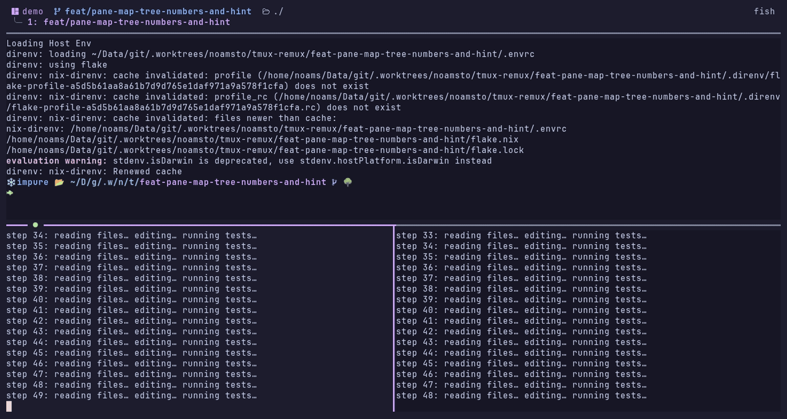

# tmux-remux

Fast, smart tmux state persistence. A Go replacement for [`tmux-resurrect`](https://github.com/tmux-plugins/tmux-resurrect) and [`tmux-continuum`](https://github.com/tmux-plugins/tmux-continuum), backed by SQLite and content-addressed scrollback files.

> **Status:** v0.4.0. Pre-release. Personal tool — used and shaped by my workflow. Bug reports welcome; feature requests will be answered with "PR welcome."


## What it does

- **Periodic save** — snapshots every tmux session, window, pane (cwd, command, layout, scrollback) every 60s and on every structural change.
- **Smart restore** — on tmux start, applies a filter that drops stale sessions, idle plain-shell panes, and duplicates of sessions already running. No more "all my closed splits from last week reappear."
- **Undo** — `prefix + u` instantly re-opens the last pane, window, or session you closed by accident (e.g. `Ctrl+D` cascade).
- **History** — every snapshot and close event lives in a SQLite store you can query, browse interactively, and prune.
- **One static binary** — no plugin manager, no shell scripts, no cron. A systemd (Linux) or launchd (macOS) user timer + tmux hooks do the work.

## Why not tmux-resurrect / tmux-continuum?

| | resurrect + continuum | tmux-remux |
|---|---|---|
| Maintenance | Stalled (last meaningful commit ~2020) | Active |
| Save speed (40 panes) | ~3-5s, sequential `tmux display-message` per pane | ~70ms, three batched `tmux -F` queries + parallel `capture-pane` |
| Auto-restore filter | None — restores everything | Smart filter (skip-running, idle-shell, stale age) |
| History | Single overwriting save file | SQLite with N rolling snapshots + close events |
| Undo for accidental `Ctrl+D` | No | `prefix + u` |
| Storage | Plain text + bash glue | SQLite + content-addressed compressed scrollback (refcount-deduped) |
| Implementation | ~1500 lines of bash | ~3500 lines of Go (with tests) |

If you love your existing resurrect+continuum setup, this won't change your life. If you've been keeping `@continuum-restore 'off'` because auto-restore is too noisy to trust — that's the problem `tmux-remux` exists to fix.

## Install

### Nix flake (recommended)

```nix
{
  inputs.tmux-remux.url = "github:noamsto/tmux-remux";

  outputs = { self, nixpkgs, tmux-remux, ... }: {
    # … reference tmux-remux.packages.${system}.default in home-manager
    # or your environment.systemPackages, e.g.:
    # home.packages = [ tmux-remux.packages.${pkgs.system}.default ];
  };
}
```

Or run directly: `nix run github:noamsto/tmux-remux -- version`.

### From source

```bash
git clone https://github.com/noamsto/tmux-remux
cd tmux-remux
go build -o tmux-remux ./cmd/tmux-remux
```

Requires Go 1.23+. No CGO needed (pure-Go SQLite via `modernc.org/sqlite`).

### TPM (tmux plugin manager)

```tmux
set -g @plugin 'noamsto/tmux-remux'
```

Then `prefix + I` to fetch and load it. The plugin script (`tmux-remux.tmux`)
resolves a `tmux-remux` binary in this order: an existing copy on `PATH`, a
previously-downloaded copy cached in the plugin's own `bin/` directory, or a
fresh download of the matching prebuilt release archive (verified against its
published `checksums.txt`) for your OS/arch. It then wires the same hooks and
binds as [`examples/tmux.conf`](examples/tmux.conf).

Options (set before `run '~/.tmux/plugins/tpm/tpm'`):

| Option | Default | Meaning |
|---|---|---|
| `@tmux_remux_version` | `latest` | Pin a specific release tag instead of always fetching the newest. |
| `@tmux_remux_auto_restore` | `on` | Set to `off` to skip `restore --auto` on tmux start (undo/save/picker binds still work). |

The systemd/launchd save timer (see below) is not managed by the plugin — the
tmux hooks above cover structural saves (new session, new window, detach,
close); the periodic 60s snapshot timer is still a separate, optional manual
step.

## Quick start

Wire tmux-remux into a running server with one line:

```sh
tmux-remux triggers | tmux source-file -
```

To make it permanent, append the output to your config once:

```sh
tmux-remux triggers --bin="$(command -v tmux-remux)" >> ~/.config/tmux/tmux.conf
```

Either way you get:

- 8 tmux hooks for save + close-event capture
- `prefix + u` (undo pop), `prefix + U` (close-event picker popup), `prefix + R` (snapshot picker popup), `prefix + Ctrl-s` (save now)
- `run-shell -b 'tmux-remux restore --auto'` for auto-restore on tmux start

[`examples/tmux.conf`](examples/tmux.conf) is that same fragment, checked in so you can read it before running it. It is **generated** — a test asserts it matches `tmux-remux triggers --tmux-version=3.8`, so edit `internal/triggers` rather than the file.

### tmux version differences

`triggers` detects tmux via `tmux -V` and renders accordingly. Override with `--tmux-version=3.8` when generating a config for a different machine.

- **tmux 3.8+** — periodic saves run inside the server via a monitor hook (`set-hook -B`), so **no external timer is needed** and you can skip the rest of this section. The watched format lives in `@remux_save_tick` (default `'%M'`, i.e. once a minute).
- **tmux < 3.8** — no monitor hooks, so periodic saves need an external timer. Set one up below.

### Linux (systemd)

```ini
# ~/.config/systemd/user/tmux-remux-save.service
[Unit]
Description=Save tmux-remux snapshot

[Service]
Type=oneshot
ExecStart=%h/.local/bin/tmux-remux save --reason=timer

# ~/.config/systemd/user/tmux-remux-save.timer
[Unit]
Description=Periodic tmux-remux save

[Timer]
OnBootSec=2min
OnUnitActiveSec=60s
Unit=tmux-remux-save.service

[Install]
WantedBy=timers.target
```

```bash
systemctl --user daemon-reload
systemctl --user enable --now tmux-remux-save.timer
```

### macOS (launchd)

Copy [`examples/tmux-remux-save.plist`](examples/tmux-remux-save.plist) into `~/Library/LaunchAgents/`, edit the `tmux-remux` path (launchd needs an absolute path — no `~`/`$HOME` expansion), then load it:

```bash
cp examples/tmux-remux-save.plist ~/Library/LaunchAgents/io.github.noamsto.tmux-remux-save.plist
launchctl bootstrap gui/$(id -u) ~/Library/LaunchAgents/io.github.noamsto.tmux-remux-save.plist
```

`StartInterval=60` fires the save every 60s. The plist sets a `PATH` covering Homebrew (Apple Silicon and Intel) because launchd starts with a minimal environment and `tmux-remux` shells out to `tmux`. To unload: `launchctl bootout gui/$(id -u)/io.github.noamsto.tmux-remux-save`.

That's it. `tmux-remux save --reason=manual` to test, `tmux-remux list` to see what was captured.

## Subcommands

| Command | Purpose |
|---|---|
| `tmux-remux save` | Snapshot the running server now (idempotent — skipped if nothing changed) |
| `tmux-remux restore --auto` | Restore the newest snapshot from before the current server started (so saves made by the freshly started server never shadow the pre-shutdown state), filtered by smart filter |
| `tmux-remux undo --pop` | Restore the most recent close event (pane / window / session) |
| `tmux-remux pick --kind=close` | Interactive picker over close events |
| `tmux-remux pick --kind=snapshot` | Interactive picker over snapshot history (default) |
| `tmux-remux capture-event KIND` | Record a close event (called from tmux hooks; not for direct use) |
| `tmux-remux list` | List events, human-readable |
| `tmux-remux list --json` | List events as newline-delimited JSON (for external pickers) |
| `tmux-remux prune` | Apply retention limits (default: keep the 20 newest snapshots plus the newest snapshot per UTC day for the last 7 days; 50 close events) |
| `tmux-remux gc` | Reap orphan scrollback files (refcount = 0) |
| `tmux-remux relaunch-stamp` | Stamp `@remux_relaunch` from an agent start hook so restore reopens the session (internal; wired via the Claude plugin or `install-hook`) |
| `tmux-remux install-hook codex` | Wire Codex's `SessionStart` hook (`~/.codex/config.toml`) to `relaunch-stamp` |
| `tmux-remux triggers` | Print the tmux.conf fragment that wires tmux-remux, rendered for the detected tmux version (used by `tmux-remux.tmux`) |
| `tmux-remux version` | Print version |

### `pick`

Open an interactive picker over snapshot or close events. The picker is a Bubble Tea TUI that shows each snapshot's full session → window → pane tree before you restore it, and exposes the smart-restore filter as live footer toggles.



- `--kind=snapshot` (default) — snapshots on the left, the selected snapshot's tree in the middle, the selected pane's captured scrollback on the right. The preview needs 120 columns; narrower than that it drops to two panes, and since the binds open the picker in a popup at 90% width, a terminal under ~134 columns never shows it. Toggle `s` to skip idle shells, `d` to skip sessions already running (shown collapsed with a `(running)` tag), `a` to dim snapshots older than 24h.
- A snapshot saved within `min_save_interval` of the previous one is stored without scrollback on purpose (it keeps a restore storm's hook-per-window saves cheap), so its preview reads `(no scrollback captured for this pane)`.
- `--kind=close` — a flat list of closes, newest first, under two headings: this session, then everything else. Each row is one close (or a collapsed run of identical ones, tagged `×N`) rendered as columns: a marker, what was closed, the directory it was in, its name, where `↵` would put it back, and its age. Repeats of the same close fold into one row, so a `Ctrl+D` cascade takes one line rather than ten. There is nothing to expand — `↑`/`↓` and `↵` are the whole story. The right-hand column previews what the row under the cursor would reopen: the captured scrollback of every pane the close took down. It follows the cursor with no Tab. The two columns sit side by side from ~163 columns up (the list's own width tops out at 100 and every further cell goes to the preview); below that the preview moves underneath the full-width list rather than being squeezed, and under 80 columns it drops away entirely. The closed panes are read out of the snapshot the close was diffed against, which is where their scrollback comes from. Used by `prefix + U`.

Tab switches focus between panes in the snapshot picker. `?` shows the full keymap. `enter` restores; `esc` cancels.

## Smart restore filter

Configurable via env vars (TODO: also via flags). Defaults:

| Filter | Default | Effect |
|---|---|---|
| `restoreMaxSnapshotAge` | 30 days | Skip whole snapshot if older (host probably reinstalled) |
| `restoreMaxSessionAge` | 14 days | Skip session if `last_attached` older than threshold |
| `restoreSkipIdleShells` | on | Skip pane if command ∈ {bash, fish, zsh, sh} AND no children |
| `restoreSkipIdleWindows` | on | Skip window if every pane filtered out |
| `skipRunningSessions` | on | Skip session if a session with that name is already running |

Allow-list of commands to re-launch on restore: `nvim`, `vim`, `htop`, `btop`, `lazygit`, `lazydocker`, `k9s`, `kubectl`, `ssh`, `mosh`, `less`, `tail`, `watch`, etc. Anything not on the list restores as a fresh shell in the saved cwd.

**Per-pane relaunch override.** A pane may set the `@remux_relaunch` user option to a full shell command (e.g. `set -p @remux_relaunch "claude --resume <uuid>"`); on restore that command is exec'd verbatim, bypassing the allow-list. This lets a tool restore a pane's exact state (a resumed session, a specific REPL) that the bare command name can't capture. The owning tool is responsible for quoting the value.

> **Coding agents:** to install tmux-remux yourself and mark your own pane for exact relaunch, follow [`docs/agent-install.md`](docs/agent-install.md) (Linux + macOS).

### Agent resume-on-restore

tmux-remux can stamp `@remux_relaunch` automatically for agent CLIs, so a pane
running Claude Code or Codex restores as its exact prior session:

- **Claude Code** — install the bundled Claude Code plugin (`claude-plugin/`,
  see its README): a `SessionStart` hook stamps `claude --resume <id>`, a
  `SessionEnd` hook clears it. Remote Control reconnects for free on resume.
- **Codex** — `tmux-remux install-hook codex` appends a `SessionStart` hook to
  `~/.codex/config.toml`, then run `codex` → `/hooks` → "Trust all" once per
  machine (Codex requires manual trust; it cannot be pre-seeded). Note Codex's
  hook fires only after the first turn, so a brand-new Codex pane snapshotted
  before its first turn restores as a shell.

Both share one binary core (`relaunch-stamp`). The stamp is exec'd verbatim
on restore via the `@remux_relaunch` override.

## Storage

```
$XDG_DATA_HOME/tmux-remux/
├── state.db                                  SQLite event store (events, scrollbacks, meta)
├── state.db-wal                              SQLite WAL file
├── state.db-shm                              SQLite shared memory
├── state.log                                 Operational decisions and errors (rotated at 1 MB)
└── scrollbacks/
    └── <sha256[:2]>/<sha256>.zst             Content-addressed, zstd-compressed pane scrollbacks
```

`$XDG_DATA_HOME` defaults to `~/.local/share`. Storage lives outside `/nix/store` and survives Nix garbage collection / generation rollback.

Scrollback files are content-addressed and refcounted — identical scrollbacks across snapshots are stored once. Files orphan-reaped weekly by `tmux-remux gc`.

Concurrent writers are serialized by an advisory `flock` on `$XDG_RUNTIME_DIR/tmux-remux/write.lock` plus SQLite WAL.

## Privacy and security

**Local-only by design.** Tmux scrollback regularly contains:

- File paths and command history (low sensitivity)
- Error messages with stack traces and internal hostnames (medium)
- Secrets pasted into prompts, env vars echoed by buggy programs, or output of `env` / `printenv` (high)

Don't sync `$XDG_DATA_HOME/tmux-remux/` to cloud storage, don't commit it, don't share snapshots. If you need cross-host portability of session structure (without the scrollback bytes), set `captureScrollback = false` and rely on cwd + command relaunch.

## Architecture

- `cmd/tmux-remux/main.go` — cobra CLI with the 11 subcommands above
- `internal/store` — SQLite layer (atomic transactional migrations, prepared queries)
- `internal/scrollback` — content-addressed file store with zstd compression and refcount-driven GC
- `internal/tmux` — wrapper around `exec.Command("tmux", …)` and parsers for `-F` output
- `internal/snapshot` — manifest types, parallel `capture-pane`, fingerprint-based throttle
- `internal/filter` — smart-restore filter as pure functions
- `internal/restore` — plan builder + apply (best-effort tmux command sequence)
- `internal/closeevent` — pane/window/session close hooks with cascade dedup
- `internal/lockfile` — advisory `flock` to serialize concurrent writers
- `internal/picker` — Bubble Tea TUI for `tmux-remux pick` (master/detail tree preview + filter toggles)
- `internal/config` — XDG-resolved paths and threshold defaults

Full design at [`docs/specs/2026-04-26-tmux-state-design.md`](docs/specs/2026-04-26-tmux-state-design.md).

## Status and roadmap

**v0.1.0 — current.** Save, restore (manual + auto), undo, Bubble Tea picker, list/prune/gc, systemd timer.

**v0.2.0 — planned.**
- Per-unit restore (restore *just* this pane / window / session from a snapshot)
- nvim cooperation (companion Lua module that writes `mksession` files on `VimLeave`)
- Cross-host cwd remap rules

**Out of scope (likely forever):**
- Cloud sync — wrong threat model (see "Privacy and security")

## Contributing

This is a personal tool I publish in case it's useful. Bug reports with reproduction steps are welcome. Feature requests are unlikely to be implemented unless I hit them in my own workflow — fork freely.

## Acknowledgements

- [`tmux-resurrect`](https://github.com/tmux-plugins/tmux-resurrect) and [`tmux-continuum`](https://github.com/tmux-plugins/tmux-continuum) for blazing the trail. The smart filter exists because they didn't.
- [`modernc.org/sqlite`](https://gitlab.com/cznic/sqlite) for pure-Go SQLite that cross-compiles trivially.
- [`klauspost/compress`](https://github.com/klauspost/compress) for fast pure-Go zstd.

## License

MIT — see [`LICENSE`](LICENSE).
